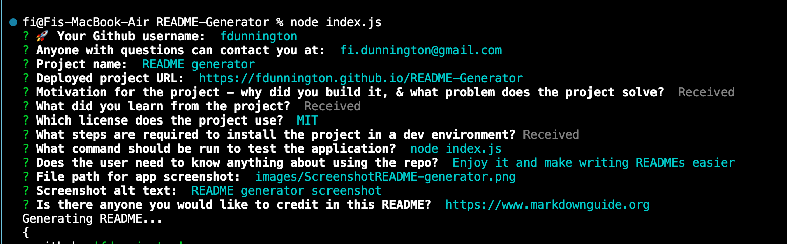

# README generator
  ----

  

  ### Depoloyed at https://fdunnington.github.io/README-Generator

  ## Description:

  #### Motivation #### 
  This project was an execrise in learning how to use node, npm, and markdown.
  The app is aimed to make creating a README an easy process, using node prompts to create the structure of the README, and the prompt answers to complete the detail of the README.

  #### Learnings #### 
  The project taught me not only about node and npm, and how they can be used to make processes more efficient, but also helped me develop a better understanding of Markdown, enabling me to create a clear and user-friendly instruction manual for my Github repos. This README was created with the generator.

  ----

  ## Table of Contents:

  * [Installation](#installation)
  * [Application usage](#usage)
  * [License](#license)
  * [Contributing](#contributing)
  * [How to test](#testing)
  * [Questions](#questions)

  ----
  

  ## Installation:
  To install the application in a dev environment, follow the instructions below: 
  ``  To use this app you will need to set install node and npm in your local dev environment. 

Step 1: 
Install node.js (https://nodejs.dev/en/download/)

Step 2: 
Create and initialize a package.json file by running the following commands in the displayed order (inside the intended directory):

	$ npm init -y
	$ npm install

Step 2: 
Install npm's Inquirer module 

	$ npm install inquirer

Step 3:
Install npm's Util module

	$ npm install util

  ## Usage
  Enjoy it and make writing READMEs easier!
  

  

  ## License
  This project uses the  license.

  ## Contributing
  
  
  
  We are happy for other developers to contribute to this project, and have adpoted the [Contributor Covenant](https://www.contributor-covenant.org/)

  ## Testing
  To run test, run the following command:
  ~~~
  node index.js
  ~~~

  ## Questions
  If you have any questions about the repo you can open an issue, or contact me directly at fi.dunnington@gmail.com.

  You can find more of my work at [fdunnington](https://github.com/fdunnington).

  ## Credits
  https://www.markdownguide.org
